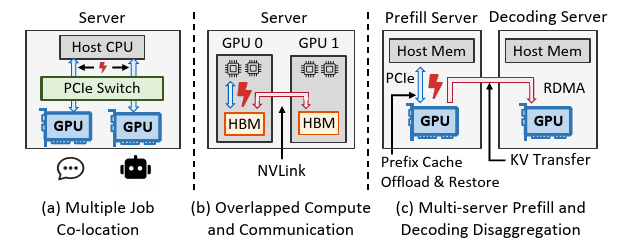
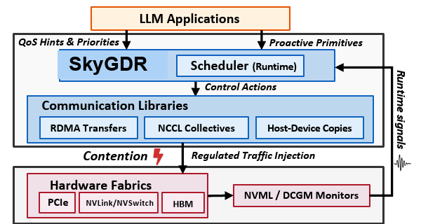

# SkyGDR: Software-defined GPU fabric scheduling for LLM systems

SkyGDR is a lightweight runtime framework that makes GPU fabric contention
visible and controllable. It monitors application progress and fabric pressure,
then regulates how aggressively communication flows enter shared PCIe, RDMA,
NVLink, and GPU-memory arbitration domains.

## Motivation

Modern LLM serving stacks move large runtime state, not just model parameters.
Prefill-decode disaggregation, KV cache offload, multi-GPU parallelism, and
compute-communication overlap all depend on GPU fabrics behaving predictably.
In practice, these fabrics are shared hardware resources with implicit
arbitration priorities.

  

Two contention patterns are especially important:

- **GPU memory contention:** NVLink DMA traffic and local GPU memory access
  compete for HBM/L2-side resources, so communication can silently slow compute.
- **PCIe contention:** GPUDirect RDMA and host-device copies share PCIe paths,
  so latency-critical KV transfer can be delayed by background KV offload.

The core problem is that current LLM systems usually schedule work, but not the
fabric itself. Once traffic enters PCIe, NVLink, or GPU memory arbitration, the
hardware decides effective priority, even when that priority conflicts with the
application's latency goals.

## Solution Overview

SkyGDR treats GPU fabric usage as an explicit scheduling problem. Applications
register communication flows with priorities or performance goals; SkyGDR
observes runtime signals; a scheduler chooses per-flow control actions that
shape traffic before it enters the shared fabric.

  

SkyGDR's control loop has three parts:

- **Signals:** PCIe/NVLink/RDMA counters, GPU memory bandwidth, queue depth,
  transfer latency, request latency, and per-flow backlog.
- **Policy:** map application goals and observed contention to bandwidth budgets
  or pacing decisions for each registered flow.
- **Actions:** apply software-visible knobs such as NIC QoS, RDMA rate limits,
  service levels, CUDA stream priorities, launch gating, chunked host-device
  copies, and cooperative yield points.

This lets best-effort traffic yield during protected windows while still making
progress when latency-critical flows are healthy.

## Case Study: KV Cache Offloading

SkyGDR was prototyped in a vLLM + Mooncake serving stack with Qwen3-8B. The
case study emulates prefill-decode disaggregation with two flows:

- `kv_transfer`: latency-critical prefill-to-decode KV transfer over GPUDirect
  RDMA.
- `kv_offload`: background prefix KV cache offload from GPU memory to CPU
  memory.

During a prefill-decode handoff, SkyGDR opens a protected window for
`kv_transfer`. If the RDMA transfer misses its target bandwidth, SkyGDR delays
or paces `kv_offload` more aggressively in the next control window. If transfer
performance is healthy, SkyGDR returns more PCIe budget to offload.

On request shapes from a real Codex/SWE-bench Pro trace, with aggregate KV sizes
from 1.2 GB to 9.4 GB, SkyGDR reduces:

- **PD KV transfer flow time by 19.4% to 34.4%.**
- **Mean time-to-first-token by 2.4% to 6.1%.**

These results show that GPU fabric contention can be moved from an opaque
hardware side effect into an application-aware runtime scheduling problem.
