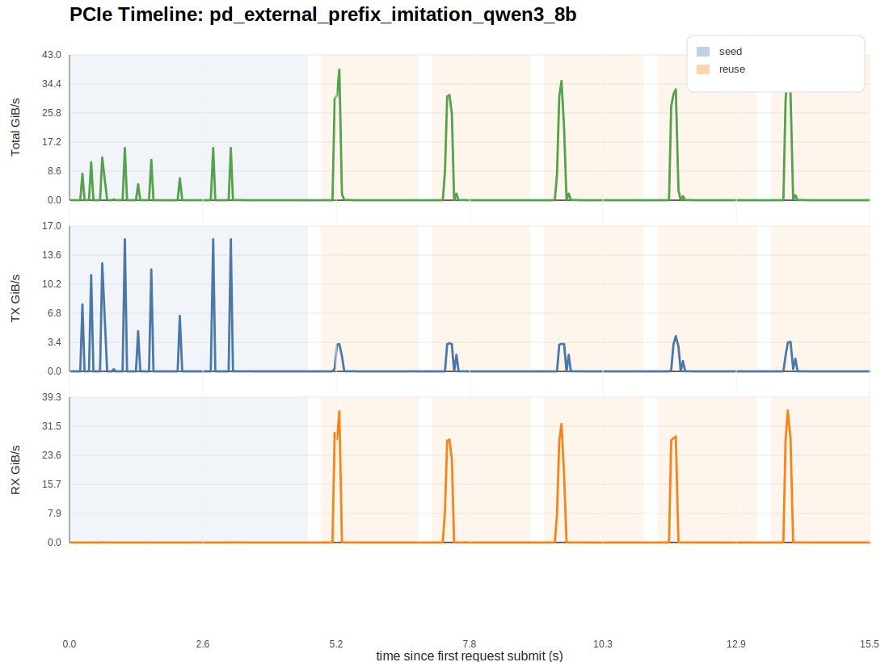
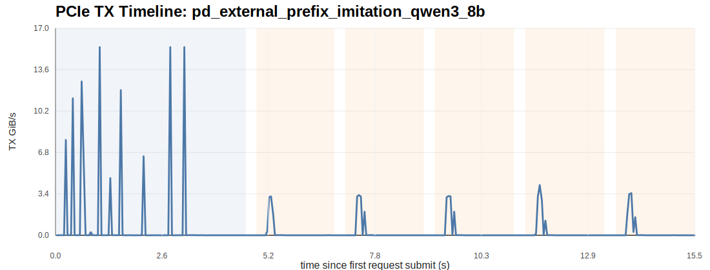
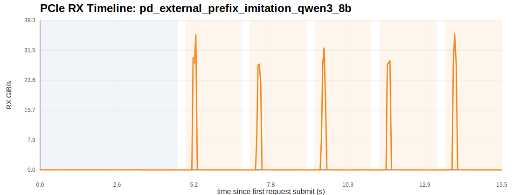

# External Prefix-Cache PCIe Report: pd_external_prefix_imitation_qwen3_8b

## 1. 观测范围

- full window start: `1774778627167`
- full window end: `1774778642691`
- requests: `6`

本报告针对的是：

- `seed`：首轮长 prompt，把完整前缀写入 external/shared prefix cache
- `reuse`：后续各轮只追加少量新 token，观察 prefill 是否从外部 cache 读回大部分历史 KV

## 2. 时序图

### TX

### RX

## 3. 全窗口统计

- duration: `15.524 s`
- total TX volume: `7.549 GiB`
- total RX volume: `20.836 GiB`
- total bidirectional volume: `28.385 GiB`
- avg TX bandwidth: `0.486 GiB/s`
- avg RX bandwidth: `1.342 GiB/s`
- avg bidirectional bandwidth: `1.828 GiB/s`
- peak TX bandwidth: `15.452 GiB/s`
- peak RX bandwidth: `35.759 GiB/s`
- peak total bandwidth: `39.132 GiB/s`

## 4. 分阶段统计

| phase | duration (s) | tx total (GiB) | rx total (GiB) | total (GiB) | avg tx GiB/s | avg rx GiB/s | peak tx GiB/s | peak rx GiB/s |
| --- | ---: | ---: | ---: | ---: | ---: | ---: | ---: | ---: |
| seed | 4.621 | 5.044 | 0.036 | 5.079 | 1.091 | 0.008 | 15.452 | 0.049 |
| reuse | 9.566 | 2.505 | 20.800 | 23.305 | 0.262 | 2.174 | 4.123 | 35.759 |

## 5. 请求级汇总

- request summary csv: `request_pcie_summary.csv`

重点建议：

- 看 `reuse` 请求的 `lmcache_remote_read_GiB` 和 `peak_rx_GiB_s`，这是最直接的 external prefix-cache prefill load 信号。
- 看 `seed` 请求的 `lmcache_remote_write_GiB` 和 `peak_tx_GiB_s`，它反映首轮长前缀是怎么被写入外部 cache 的。
- 如果 `lmcache_hit_ratio` 很高但 `peak_rx_GiB_s` 不高，通常意味着外部读回被更平滑地摊开了，而不是没有命中。

