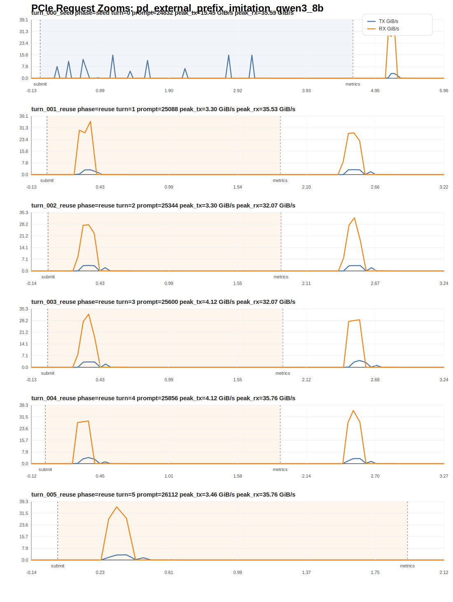

# External Prefix-Cache Imitation Report

## 1. 实验目标

这份结果面向的是：

- 使用真实 Terminal-Bench 2.0 trajectories 构造多 session agent workload
- 先用 `seed` requests 把长历史前缀写入 LMCache external/shared cache
- 再按 `reuse_round_*` 并发发出多个高复用 turn，把 aggregate prefill load 尽量打满
- 直接看 prefill 侧 external read 和 PCIe RX/H2D 是否被持续抬高

## 2. 工作负载概况

- requests: `6`
- dispatch groups: `6`
- max concurrent requests per group: `1`
- seed requests: `1`
- reuse requests: `5`
- mean text-side reuse ratio: `99.00%`
- mean request peak RX: `31.981 GiB/s`
- mean request peak TX: `3.458 GiB/s`
- mean reuse-group remote read: `2.067 GiB/group`
- total reuse-group remote read: `10.336 GiB`
- mean reuse-group LMCache hit ratio: `20.00%`
- total seed-group remote write: `0.000 GiB`

说明：

- 当前 `lmcache_*` 的请求级字段不再作为主真值；并发模式下，LMCache metrics 以 `dispatch_group` 为归因单位。
- 因此最重要的是 `group_lmcache_remote_read_GiB`、`group_lmcache_hit_ratio` 和 PCIe RX 图。

## 3. 全局 PCIe 图

## 4. 分阶段统计

| phase | duration (s) | total transfer (GiB) | avg TX GiB/s | avg RX GiB/s | peak TX GiB/s | peak RX GiB/s |
| --- | ---: | ---: | ---: | ---: | ---: | ---: |
| seed | 4.621 | 5.079 | 1.091 | 0.008 | 15.452 | 0.049 |
| reuse | 9.566 | 23.305 | 0.262 | 2.174 | 4.123 | 35.759 |

## 5. dispatch-group 级摘要

| dispatch_group | phase | size | group read GiB | group write GiB | group hit ratio |
| --- | --- | ---: | ---: | ---: | ---: |
| turn_000_seed | seed | 1 | 0.000 | 0.000 | 0.00% |
| turn_001_reuse | reuse | 1 | 0.000 | 0.000 | 0.00% |
| turn_002_reuse | reuse | 1 | 0.000 | 0.000 | 0.00% |
| turn_003_reuse | reuse | 1 | 10.336 | 3.516 | 100.00% |
| turn_004_reuse | reuse | 1 | 0.000 | 0.000 | 0.00% |
| turn_005_reuse | reuse | 1 | 0.000 | 0.000 | 0.00% |

## 6. 请求级摘要

| request_id | phase | session | turn | prompt tokens | reuse ratio | peak RX GiB/s | peak TX GiB/s | elapsed ms |
| --- | --- | --- | ---: | ---: | ---: | ---: | ---: | ---: |
| turn_000_seed | seed | main_session | 0 | 24832 | 0.00% | 0.049 | 15.452 | 3413.00 |
| turn_001_reuse | reuse | main_session | 1 | 25088 | 98.98% | 35.530 | 3.189 | 677.00 |
| turn_002_reuse | reuse | main_session | 2 | 25344 | 98.99% | 27.852 | 3.299 | 690.00 |
| turn_003_reuse | reuse | main_session | 3 | 25600 | 99.00% | 32.067 | 3.221 | 697.00 |
| turn_004_reuse | reuse | main_session | 4 | 25856 | 99.01% | 28.699 | 4.123 | 700.00 |
| turn_005_reuse | reuse | main_session | 5 | 26112 | 99.02% | 35.759 | 3.457 | 699.00 |

## 7. 如何解读

- `seed` 阶段看的是首轮长上下文如何写入 external cache，因此更容易偏向 `TX / remote write`。
- `reuse` 阶段看的是多 session 并发 prefill 如何从 external cache 拉历史 KV，因此更应该看 `group_lmcache_remote_read_GiB` 与 `RX`。
- 如果你要判断 prefill 是否被持续打满，优先看 `reuse` 的 aggregate RX，而不是单个请求的短 burst。

当前请求级最强的 RX 峰出现在 `turn_005_reuse`，`peak RX = 35.759 GiB/s`。

