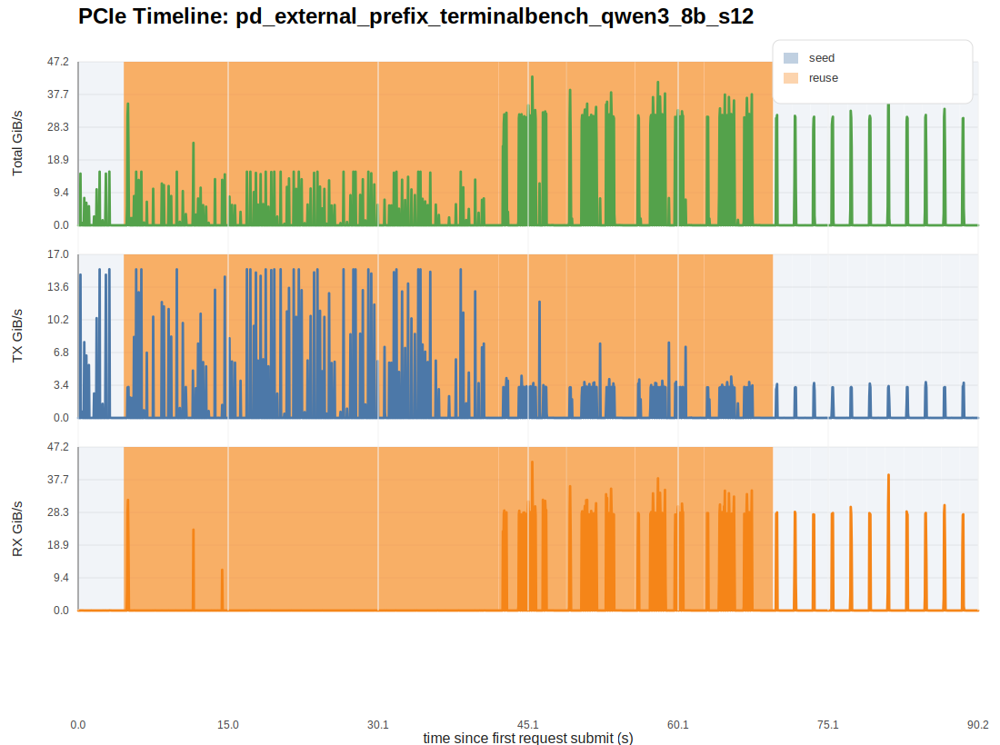
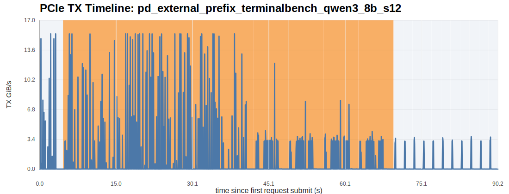
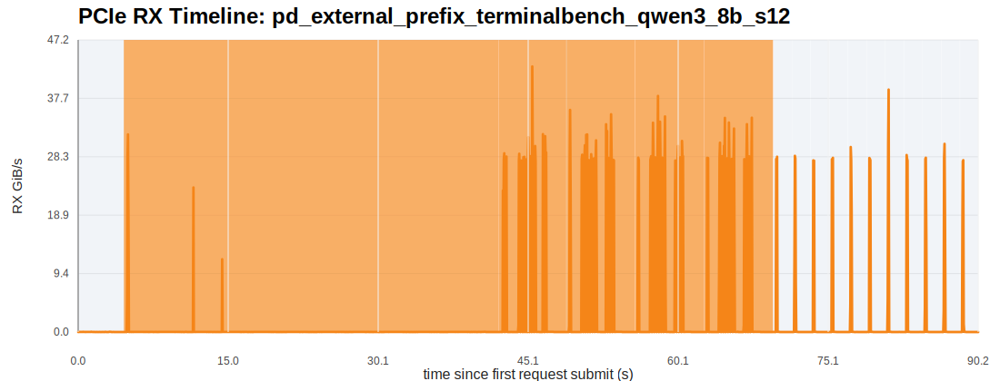
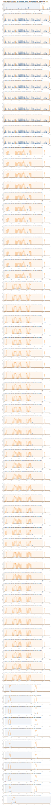

# External Prefix-Cache Imitation Report

## 1. 实验目标

这份结果面向的是：

- 使用真实 Terminal-Bench 2.0 trajectories 构造多 session agent workload
- 先用 `seed` requests 把长历史前缀写入 LMCache external/shared cache
- 再按 `reuse_round_*` 并发发出多个高复用 turn，把 aggregate prefill load 尽量打满
- 直接看 prefill 侧 external read 和 PCIe RX/H2D 是否被持续抬高

## 2. 工作负载概况

- requests: `72`
- dispatch groups: `17`
- max concurrent requests per group: `12`
- seed requests: `12`
- reuse requests: `60`
- mean text-side reuse ratio: `98.99%`
- mean request peak RX: `36.674 GiB/s`
- mean request peak TX: `9.481 GiB/s`
- mean reuse-group remote read: `26.564 GiB/group`
- total reuse-group remote read: `132.820 GiB`
- mean reuse-group LMCache hit ratio: `80.46%`
- total seed-group remote write: `3.762 GiB`

说明：

- 当前 `lmcache_*` 的请求级字段不再作为主真值；并发模式下，LMCache metrics 以 `dispatch_group` 为归因单位。
- 因此最重要的是 `group_lmcache_remote_read_GiB`、`group_lmcache_hit_ratio` 和 PCIe RX 图。

## 3. 全局 PCIe 图

## 4. 分阶段统计

| phase | duration (s) | total transfer (GiB) | avg TX GiB/s | avg RX GiB/s | peak TX GiB/s | peak RX GiB/s |
| --- | ---: | ---: | ---: | ---: | ---: | ---: |
| seed | 24.891 | 50.303 | 0.361 | 1.660 | 15.453 | 39.149 |
| reuse | 64.934 | 261.256 | 1.005 | 3.019 | 15.461 | 42.881 |

## 5. dispatch-group 级摘要

| dispatch_group | phase | size | group read GiB | group write GiB | group hit ratio |
| --- | --- | ---: | ---: | ---: | ---: |
| seed_tb_session_00 | seed | 1 | 0.000 | 3.375 | 0.00% |
| reuse_round_001 | reuse | 12 | 5.203 | 28.406 | 100.00% |
| reuse_round_002 | reuse | 12 | 6.961 | 7.242 | 100.00% |
| reuse_round_003 | reuse | 12 | 71.965 | 0.633 | 95.21% |
| reuse_round_004 | reuse | 12 | 0.000 | 0.000 | 0.00% |
| reuse_round_005 | reuse | 12 | 48.691 | 0.598 | 107.08% |
| seed_tb_session_01 | seed | 1 | 0.000 | 0.000 | 0.00% |
| seed_tb_session_02 | seed | 1 | 0.000 | 0.000 | 0.00% |
| seed_tb_session_03 | seed | 1 | 45.387 | 0.387 | 100.00% |
| seed_tb_session_04 | seed | 1 | 0.000 | 0.000 | 0.00% |
| seed_tb_session_05 | seed | 1 | 0.000 | 0.000 | 0.00% |
| seed_tb_session_06 | seed | 1 | 0.000 | 0.000 | 0.00% |
| seed_tb_session_07 | seed | 1 | 0.000 | 0.000 | 0.00% |
| seed_tb_session_08 | seed | 1 | 20.250 | 0.000 | 100.00% |
| seed_tb_session_09 | seed | 1 | 0.000 | 0.000 | 0.00% |
| seed_tb_session_10 | seed | 1 | 0.000 | 0.000 | 0.00% |
| seed_tb_session_11 | seed | 1 | 0.000 | 0.000 | 0.00% |

## 6. 请求级摘要

| request_id | phase | session | turn | prompt tokens | reuse ratio | peak RX GiB/s | peak TX GiB/s | elapsed ms |
| --- | --- | --- | ---: | ---: | ---: | ---: | ---: | ---: |
| tb_session_00_turn_000_seed | seed | tb_session_00 | 0 | 24576 | 0.00% | 0.045 | 15.453 | 3348.00 |
| tb_session_00_turn_001_reuse | reuse | tb_session_00 | 1 | 24832 | 98.97% | 31.898 | 15.461 | 4779.00 |
| tb_session_01_turn_001_reuse | reuse | tb_session_01 | 1 | 24832 | 98.97% | 31.898 | 15.461 | 7982.00 |
| tb_session_02_turn_001_reuse | reuse | tb_session_02 | 1 | 24832 | 98.97% | 31.898 | 15.461 | 11733.00 |
| tb_session_03_turn_001_reuse | reuse | tb_session_03 | 1 | 24832 | 98.97% | 31.898 | 15.461 | 14509.00 |
| tb_session_04_turn_001_reuse | reuse | tb_session_04 | 1 | 24832 | 98.97% | 31.898 | 15.461 | 17289.00 |
| tb_session_05_turn_001_reuse | reuse | tb_session_05 | 1 | 24832 | 98.97% | 31.898 | 15.461 | 20590.00 |
| tb_session_06_turn_001_reuse | reuse | tb_session_06 | 1 | 24832 | 98.97% | 31.898 | 15.461 | 30713.00 |
| tb_session_07_turn_001_reuse | reuse | tb_session_07 | 1 | 24832 | 98.97% | 31.898 | 15.461 | 27331.00 |
| tb_session_08_turn_001_reuse | reuse | tb_session_08 | 1 | 24832 | 98.97% | 31.898 | 15.461 | 36126.00 |
| tb_session_09_turn_001_reuse | reuse | tb_session_09 | 1 | 24832 | 98.97% | 31.898 | 15.461 | 23959.00 |
| tb_session_10_turn_001_reuse | reuse | tb_session_10 | 1 | 24832 | 98.97% | 31.898 | 15.461 | 33764.00 |
| tb_session_11_turn_001_reuse | reuse | tb_session_11 | 1 | 24832 | 98.97% | 31.898 | 15.461 | 36287.00 |
| tb_session_00_turn_002_reuse | reuse | tb_session_00 | 2 | 25088 | 98.98% | 42.881 | 12.084 | 5487.00 |
| tb_session_01_turn_002_reuse | reuse | tb_session_01 | 2 | 25088 | 98.98% | 42.881 | 12.084 | 5486.00 |
| tb_session_02_turn_002_reuse | reuse | tb_session_02 | 2 | 25088 | 98.98% | 42.881 | 12.084 | 5523.00 |
| tb_session_03_turn_002_reuse | reuse | tb_session_03 | 2 | 25088 | 98.98% | 42.881 | 12.084 | 5520.00 |
| tb_session_04_turn_002_reuse | reuse | tb_session_04 | 2 | 25088 | 98.98% | 42.881 | 12.084 | 5520.00 |
| tb_session_05_turn_002_reuse | reuse | tb_session_05 | 2 | 25088 | 98.98% | 42.881 | 12.084 | 5518.00 |
| tb_session_06_turn_002_reuse | reuse | tb_session_06 | 2 | 25088 | 98.98% | 42.881 | 12.084 | 5516.00 |
| tb_session_07_turn_002_reuse | reuse | tb_session_07 | 2 | 25088 | 98.98% | 42.881 | 12.084 | 5515.00 |
| tb_session_08_turn_002_reuse | reuse | tb_session_08 | 2 | 25088 | 98.98% | 42.881 | 12.084 | 5515.00 |
| tb_session_09_turn_002_reuse | reuse | tb_session_09 | 2 | 25088 | 98.98% | 42.881 | 12.084 | 5527.00 |
| tb_session_10_turn_002_reuse | reuse | tb_session_10 | 2 | 25088 | 98.98% | 42.881 | 12.084 | 5526.00 |
| tb_session_11_turn_002_reuse | reuse | tb_session_11 | 2 | 25088 | 98.98% | 42.881 | 12.084 | 5525.00 |
| tb_session_00_turn_003_reuse | reuse | tb_session_00 | 3 | 25344 | 98.99% | 35.861 | 7.731 | 5546.00 |
| tb_session_01_turn_003_reuse | reuse | tb_session_01 | 3 | 25344 | 98.99% | 35.861 | 7.731 | 5585.00 |
| tb_session_02_turn_003_reuse | reuse | tb_session_02 | 3 | 25344 | 98.99% | 35.861 | 7.731 | 5584.00 |
| tb_session_03_turn_003_reuse | reuse | tb_session_03 | 3 | 25344 | 98.99% | 35.861 | 7.731 | 5583.00 |
| tb_session_04_turn_003_reuse | reuse | tb_session_04 | 3 | 25344 | 98.99% | 35.861 | 7.731 | 5581.00 |
| tb_session_05_turn_003_reuse | reuse | tb_session_05 | 3 | 25344 | 98.99% | 35.861 | 7.731 | 5580.00 |
| tb_session_06_turn_003_reuse | reuse | tb_session_06 | 3 | 25344 | 98.99% | 35.861 | 7.731 | 5579.00 |
| tb_session_07_turn_003_reuse | reuse | tb_session_07 | 3 | 25344 | 98.99% | 35.861 | 7.731 | 5602.00 |
| tb_session_08_turn_003_reuse | reuse | tb_session_08 | 3 | 25344 | 98.99% | 35.861 | 7.731 | 5600.00 |
| tb_session_09_turn_003_reuse | reuse | tb_session_09 | 3 | 25344 | 98.99% | 35.861 | 7.731 | 5600.00 |
| tb_session_10_turn_003_reuse | reuse | tb_session_10 | 3 | 25344 | 98.99% | 35.861 | 7.731 | 5598.00 |
| tb_session_11_turn_003_reuse | reuse | tb_session_11 | 3 | 25344 | 98.99% | 35.861 | 7.731 | 5596.00 |
| tb_session_00_turn_004_reuse | reuse | tb_session_00 | 4 | 25600 | 99.00% | 38.122 | 7.831 | 5591.00 |
| tb_session_01_turn_004_reuse | reuse | tb_session_01 | 4 | 25600 | 99.00% | 38.122 | 7.831 | 5631.00 |
| tb_session_02_turn_004_reuse | reuse | tb_session_02 | 4 | 25600 | 99.00% | 38.122 | 7.831 | 5630.00 |
| tb_session_03_turn_004_reuse | reuse | tb_session_03 | 4 | 25600 | 99.00% | 38.122 | 7.831 | 5627.00 |
| tb_session_04_turn_004_reuse | reuse | tb_session_04 | 4 | 25600 | 99.00% | 38.122 | 7.831 | 5627.00 |
| tb_session_05_turn_004_reuse | reuse | tb_session_05 | 4 | 25600 | 99.00% | 38.122 | 7.831 | 5624.00 |
| tb_session_06_turn_004_reuse | reuse | tb_session_06 | 4 | 25600 | 99.00% | 38.122 | 7.831 | 5624.00 |
| tb_session_07_turn_004_reuse | reuse | tb_session_07 | 4 | 25600 | 99.00% | 38.122 | 7.831 | 5648.00 |
| tb_session_08_turn_004_reuse | reuse | tb_session_08 | 4 | 25600 | 99.00% | 38.122 | 7.831 | 5646.00 |
| tb_session_09_turn_004_reuse | reuse | tb_session_09 | 4 | 25600 | 99.00% | 38.122 | 7.831 | 5645.00 |
| tb_session_10_turn_004_reuse | reuse | tb_session_10 | 4 | 25600 | 99.00% | 38.122 | 7.831 | 5644.00 |
| tb_session_11_turn_004_reuse | reuse | tb_session_11 | 4 | 25600 | 99.00% | 38.122 | 7.831 | 5643.00 |
| tb_session_00_turn_005_reuse | reuse | tb_session_00 | 5 | 25856 | 99.01% | 34.605 | 4.295 | 5613.00 |
| tb_session_01_turn_005_reuse | reuse | tb_session_01 | 5 | 25856 | 99.01% | 34.605 | 4.295 | 5653.00 |
| tb_session_02_turn_005_reuse | reuse | tb_session_02 | 5 | 25856 | 99.01% | 34.605 | 4.295 | 5652.00 |
| tb_session_03_turn_005_reuse | reuse | tb_session_03 | 5 | 25856 | 99.01% | 34.605 | 4.295 | 5650.00 |
| tb_session_04_turn_005_reuse | reuse | tb_session_04 | 5 | 25856 | 99.01% | 34.605 | 4.295 | 5649.00 |
| tb_session_05_turn_005_reuse | reuse | tb_session_05 | 5 | 25856 | 99.01% | 34.605 | 4.295 | 5648.00 |
| tb_session_06_turn_005_reuse | reuse | tb_session_06 | 5 | 25856 | 99.01% | 34.605 | 4.295 | 5646.00 |
| tb_session_07_turn_005_reuse | reuse | tb_session_07 | 5 | 25856 | 99.01% | 34.605 | 4.295 | 5669.00 |
| tb_session_08_turn_005_reuse | reuse | tb_session_08 | 5 | 25856 | 99.01% | 34.605 | 4.295 | 5668.00 |
| tb_session_09_turn_005_reuse | reuse | tb_session_09 | 5 | 25856 | 99.01% | 34.605 | 4.295 | 5667.00 |
| tb_session_10_turn_005_reuse | reuse | tb_session_10 | 5 | 25856 | 99.01% | 34.605 | 4.295 | 5665.00 |
| tb_session_11_turn_005_reuse | reuse | tb_session_11 | 5 | 25856 | 99.01% | 34.605 | 4.295 | 5664.00 |
| tb_session_01_turn_000_seed | seed | tb_session_01 | 0 | 24576 | 0.00% | 28.299 | 3.520 | 655.00 |
| tb_session_02_turn_000_seed | seed | tb_session_02 | 0 | 24576 | 0.00% | 28.455 | 3.189 | 619.00 |
| tb_session_03_turn_000_seed | seed | tb_session_03 | 0 | 24576 | 0.00% | 27.721 | 3.630 | 621.00 |
| tb_session_04_turn_000_seed | seed | tb_session_04 | 0 | 24576 | 0.00% | 28.127 | 3.188 | 618.00 |
| tb_session_05_turn_000_seed | seed | tb_session_05 | 0 | 24576 | 0.00% | 29.867 | 3.215 | 618.00 |
| tb_session_06_turn_000_seed | seed | tb_session_06 | 0 | 24576 | 0.00% | 28.092 | 3.570 | 632.00 |
| tb_session_07_turn_000_seed | seed | tb_session_07 | 0 | 24576 | 0.00% | 39.149 | 3.308 | 618.00 |
| tb_session_08_turn_000_seed | seed | tb_session_08 | 0 | 24576 | 0.00% | 28.574 | 3.204 | 617.00 |
| tb_session_09_turn_000_seed | seed | tb_session_09 | 0 | 24576 | 0.00% | 28.133 | 3.722 | 617.00 |
| tb_session_10_turn_000_seed | seed | tb_session_10 | 0 | 24576 | 0.00% | 30.386 | 3.205 | 632.00 |
| tb_session_11_turn_000_seed | seed | tb_session_11 | 0 | 24576 | 0.00% | 27.742 | 3.656 | 615.00 |

## 7. 如何解读

- `seed` 阶段看的是首轮长上下文如何写入 external cache，因此更容易偏向 `TX / remote write`。
- `reuse` 阶段看的是多 session 并发 prefill 如何从 external cache 拉历史 KV，因此更应该看 `group_lmcache_remote_read_GiB` 与 `RX`。
- 如果你要判断 prefill 是否被持续打满，优先看 `reuse` 的 aggregate RX，而不是单个请求的短 burst。

当前请求级最强的 RX 峰出现在 `tb_session_00_turn_002_reuse`，`peak RX = 42.881 GiB/s`。

