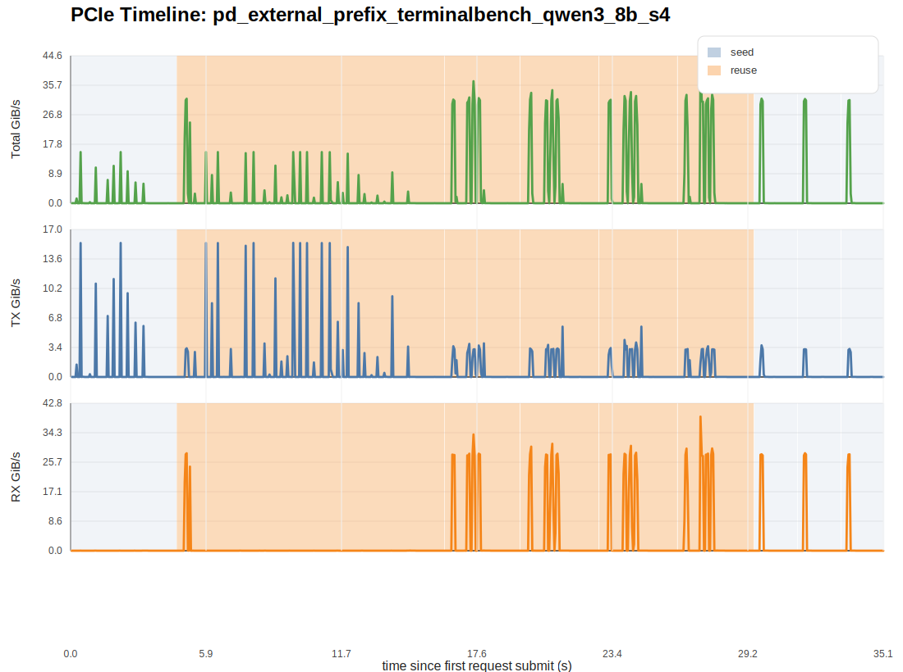
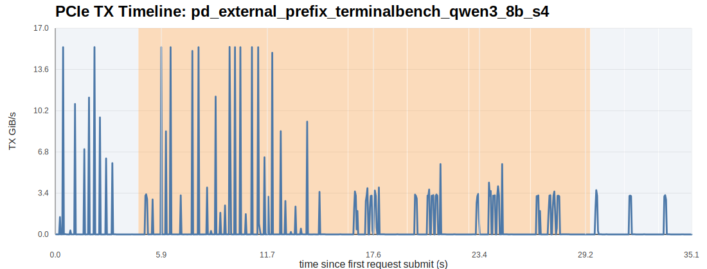
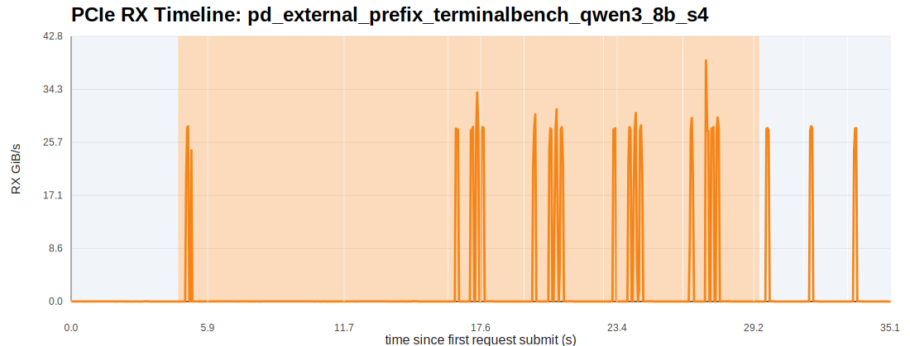
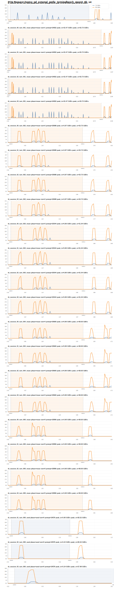

# External Prefix-Cache Imitation Report

## 1. 实验目标

这份结果面向的是：

- 使用真实 Terminal-Bench 2.0 trajectories 构造多 session agent workload
- 先用 `seed` requests 把长历史前缀写入 LMCache external/shared cache
- 再按 `reuse_round_*` 并发发出多个高复用 turn，把 aggregate prefill load 尽量打满
- 直接看 prefill 侧 external read 和 PCIe RX/H2D 是否被持续抬高

## 2. 工作负载概况

- requests: `24`
- dispatch groups: `9`
- max concurrent requests per group: `4`
- seed requests: `4`
- reuse requests: `20`
- mean text-side reuse ratio: `98.99%`
- mean request peak RX: `32.490 GiB/s`
- mean request peak TX: `6.898 GiB/s`
- mean reuse-group remote read: `8.360 GiB/group`
- total reuse-group remote read: `41.801 GiB`
- mean reuse-group LMCache hit ratio: `38.31%`
- total seed-group remote write: `3.621 GiB`

说明：

- 当前 `lmcache_*` 的请求级字段不再作为主真值；并发模式下，LMCache metrics 以 `dispatch_group` 为归因单位。
- 因此最重要的是 `group_lmcache_remote_read_GiB`、`group_lmcache_hit_ratio` 和 PCIe RX 图。

## 3. 全局 PCIe 图

## 4. 分阶段统计

| phase | duration (s) | total transfer (GiB) | avg TX GiB/s | avg RX GiB/s | peak TX GiB/s | peak RX GiB/s |
| --- | ---: | ---: | ---: | ---: | ---: | ---: |
| seed | 10.136 | 16.358 | 0.485 | 1.129 | 15.456 | 28.319 |
| reuse | 24.828 | 86.128 | 0.762 | 2.707 | 15.472 | 38.931 |

## 5. dispatch-group 级摘要

| dispatch_group | phase | size | group read GiB | group write GiB | group hit ratio |
| --- | --- | ---: | ---: | ---: | ---: |
| seed_tb_session_00 | seed | 1 | 0.000 | 3.375 | 0.00% |
| reuse_round_001 | reuse | 4 | 3.973 | 9.281 | 100.00% |
| reuse_round_002 | reuse | 4 | 0.000 | 0.000 | 0.00% |
| reuse_round_003 | reuse | 4 | 0.000 | 0.000 | 0.00% |
| reuse_round_004 | reuse | 4 | 37.828 | 0.738 | 91.57% |
| reuse_round_005 | reuse | 4 | 0.000 | 0.000 | 0.00% |
| seed_tb_session_01 | seed | 1 | 0.000 | 0.000 | 0.00% |
| seed_tb_session_02 | seed | 1 | 0.000 | 0.000 | 0.00% |
| seed_tb_session_03 | seed | 1 | 27.668 | 0.246 | 114.39% |

## 6. 请求级摘要

| request_id | phase | session | turn | prompt tokens | reuse ratio | peak RX GiB/s | peak TX GiB/s | elapsed ms |
| --- | --- | --- | ---: | ---: | ---: | ---: | ---: | ---: |
| tb_session_00_turn_000_seed | seed | tb_session_00 | 0 | 24576 | 0.00% | 0.028 | 15.456 | 3362.00 |
| tb_session_00_turn_001_reuse | reuse | tb_session_00 | 1 | 24832 | 98.97% | 28.295 | 15.472 | 4786.00 |
| tb_session_01_turn_001_reuse | reuse | tb_session_01 | 1 | 24832 | 98.97% | 28.295 | 15.472 | 7884.00 |
| tb_session_02_turn_001_reuse | reuse | tb_session_02 | 1 | 24832 | 98.97% | 28.295 | 15.472 | 10166.00 |
| tb_session_03_turn_001_reuse | reuse | tb_session_03 | 1 | 24832 | 98.97% | 28.295 | 15.472 | 10325.00 |
| tb_session_00_turn_002_reuse | reuse | tb_session_00 | 2 | 25088 | 98.98% | 33.726 | 3.873 | 2004.00 |
| tb_session_01_turn_002_reuse | reuse | tb_session_01 | 2 | 25088 | 98.98% | 33.726 | 3.873 | 2022.00 |
| tb_session_02_turn_002_reuse | reuse | tb_session_02 | 2 | 25088 | 98.98% | 33.726 | 3.873 | 2019.00 |
| tb_session_03_turn_002_reuse | reuse | tb_session_03 | 2 | 25088 | 98.98% | 33.726 | 3.873 | 2019.00 |
| tb_session_00_turn_003_reuse | reuse | tb_session_00 | 3 | 25344 | 98.99% | 31.044 | 5.801 | 2122.00 |
| tb_session_01_turn_003_reuse | reuse | tb_session_01 | 3 | 25344 | 98.99% | 31.044 | 5.801 | 2142.00 |
| tb_session_02_turn_003_reuse | reuse | tb_session_02 | 3 | 25344 | 98.99% | 31.044 | 5.801 | 2140.00 |
| tb_session_03_turn_003_reuse | reuse | tb_session_03 | 3 | 25344 | 98.99% | 31.044 | 5.801 | 2138.00 |
| tb_session_00_turn_004_reuse | reuse | tb_session_00 | 4 | 25600 | 99.00% | 30.452 | 5.801 | 2127.00 |
| tb_session_01_turn_004_reuse | reuse | tb_session_01 | 4 | 25600 | 99.00% | 30.452 | 5.801 | 2145.00 |
| tb_session_02_turn_004_reuse | reuse | tb_session_02 | 4 | 25600 | 99.00% | 30.452 | 5.801 | 2144.00 |
| tb_session_03_turn_004_reuse | reuse | tb_session_03 | 4 | 25600 | 99.00% | 30.452 | 5.801 | 2143.00 |
| tb_session_00_turn_005_reuse | reuse | tb_session_00 | 5 | 25856 | 99.01% | 38.931 | 3.541 | 2034.00 |
| tb_session_01_turn_005_reuse | reuse | tb_session_01 | 5 | 25856 | 99.01% | 38.931 | 3.541 | 2052.00 |
| tb_session_02_turn_005_reuse | reuse | tb_session_02 | 5 | 25856 | 99.01% | 38.931 | 3.541 | 2051.00 |
| tb_session_03_turn_005_reuse | reuse | tb_session_03 | 5 | 25856 | 99.01% | 38.931 | 3.541 | 2049.00 |
| tb_session_01_turn_000_seed | seed | tb_session_01 | 0 | 24576 | 0.00% | 27.991 | 3.651 | 628.00 |
| tb_session_02_turn_000_seed | seed | tb_session_02 | 0 | 24576 | 0.00% | 28.319 | 3.201 | 617.00 |
| tb_session_03_turn_000_seed | seed | tb_session_03 | 0 | 24576 | 0.00% | 27.981 | 3.238 | 637.00 |

## 7. 如何解读

- `seed` 阶段看的是首轮长上下文如何写入 external cache，因此更容易偏向 `TX / remote write`。
- `reuse` 阶段看的是多 session 并发 prefill 如何从 external cache 拉历史 KV，因此更应该看 `group_lmcache_remote_read_GiB` 与 `RX`。
- 如果你要判断 prefill 是否被持续打满，优先看 `reuse` 的 aggregate RX，而不是单个请求的短 burst。

当前请求级最强的 RX 峰出现在 `tb_session_00_turn_005_reuse`，`peak RX = 38.931 GiB/s`。

