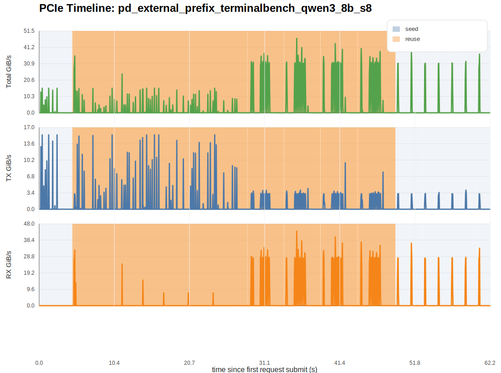
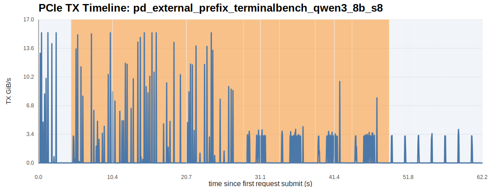
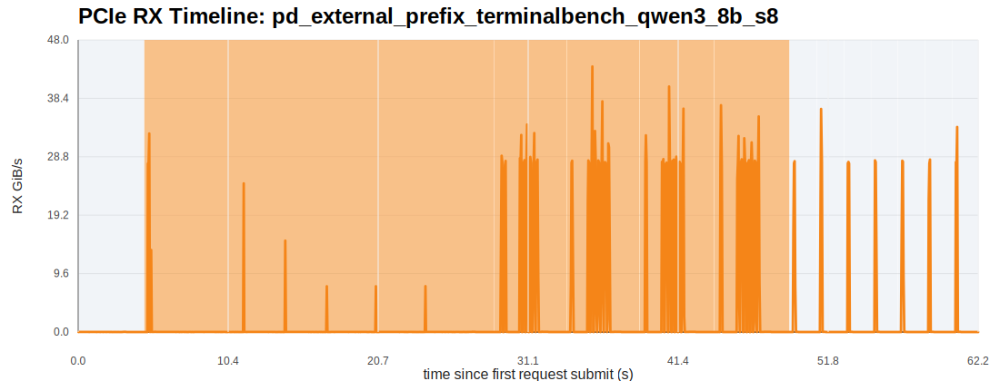
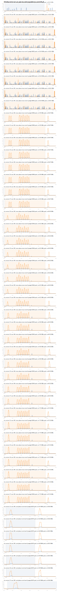

# External Prefix-Cache Imitation Report

## 1. 实验目标

这份结果面向的是：

- 使用真实 Terminal-Bench 2.0 trajectories 构造多 session agent workload
- 先用 `seed` requests 把长历史前缀写入 LMCache external/shared cache
- 再按 `reuse_round_*` 并发发出多个高复用 turn，把 aggregate prefill load 尽量打满
- 直接看 prefill 侧 external read 和 PCIe RX/H2D 是否被持续抬高

## 2. 工作负载概况

- requests: `48`
- dispatch groups: `13`
- max concurrent requests per group: `8`
- seed requests: `8`
- reuse requests: `40`
- mean text-side reuse ratio: `98.99%`
- mean request peak RX: `37.575 GiB/s`
- mean request peak TX: `8.218 GiB/s`
- mean reuse-group remote read: `12.684 GiB/group`
- total reuse-group remote read: `63.422 GiB`
- mean reuse-group LMCache hit ratio: `41.50%`
- total seed-group remote write: `0.562 GiB`

说明：

- 当前 `lmcache_*` 的请求级字段不再作为主真值；并发模式下，LMCache metrics 以 `dispatch_group` 为归因单位。
- 因此最重要的是 `group_lmcache_remote_read_GiB`、`group_lmcache_hit_ratio` 和 PCIe RX 图。

## 3. 全局 PCIe 图

## 4. 分阶段统计

| phase | duration (s) | total transfer (GiB) | avg TX GiB/s | avg RX GiB/s | peak TX GiB/s | peak RX GiB/s |
| --- | ---: | ---: | ---: | ---: | ---: | ---: |
| seed | 17.501 | 34.359 | 0.445 | 1.518 | 15.468 | 36.641 |
| reuse | 44.457 | 170.152 | 0.843 | 2.984 | 15.452 | 43.618 |

## 5. dispatch-group 级摘要

| dispatch_group | phase | size | group read GiB | group write GiB | group hit ratio |
| --- | --- | ---: | ---: | ---: | ---: |
| seed_tb_session_00 | seed | 1 | 0.000 | 0.000 | 0.00% |
| reuse_round_001 | reuse | 8 | 4.852 | 17.578 | 100.00% |
| reuse_round_002 | reuse | 8 | 3.691 | 7.945 | 7.62% |
| reuse_round_003 | reuse | 8 | 0.000 | 0.000 | 0.00% |
| reuse_round_004 | reuse | 8 | 54.879 | 0.562 | 99.87% |
| reuse_round_005 | reuse | 8 | 0.000 | 0.000 | 0.00% |
| seed_tb_session_01 | seed | 1 | 52.418 | 0.562 | 106.64% |
| seed_tb_session_02 | seed | 1 | 0.000 | 0.000 | 0.00% |
| seed_tb_session_03 | seed | 1 | 0.000 | 0.000 | 0.00% |
| seed_tb_session_04 | seed | 1 | 0.000 | 0.000 | 0.00% |
| seed_tb_session_05 | seed | 1 | 0.000 | 0.000 | 0.00% |
| seed_tb_session_06 | seed | 1 | 20.250 | 0.000 | 100.00% |
| seed_tb_session_07 | seed | 1 | 0.000 | 0.000 | 0.00% |

## 6. 请求级摘要

| request_id | phase | session | turn | prompt tokens | reuse ratio | peak RX GiB/s | peak TX GiB/s | elapsed ms |
| --- | --- | --- | ---: | ---: | ---: | ---: | ---: | ---: |
| tb_session_00_turn_000_seed | seed | tb_session_00 | 0 | 24576 | 0.00% | 0.027 | 15.468 | 3352.00 |
| tb_session_00_turn_001_reuse | reuse | tb_session_00 | 1 | 24832 | 98.97% | 32.609 | 15.452 | 4673.00 |
| tb_session_01_turn_001_reuse | reuse | tb_session_01 | 1 | 24832 | 98.97% | 32.609 | 15.452 | 7876.00 |
| tb_session_02_turn_001_reuse | reuse | tb_session_02 | 1 | 24832 | 98.97% | 32.609 | 15.452 | 11632.00 |
| tb_session_03_turn_001_reuse | reuse | tb_session_03 | 1 | 24832 | 98.97% | 32.609 | 15.452 | 14418.00 |
| tb_session_04_turn_001_reuse | reuse | tb_session_04 | 1 | 24832 | 98.97% | 32.609 | 15.452 | 17239.00 |
| tb_session_05_turn_001_reuse | reuse | tb_session_05 | 1 | 24832 | 98.97% | 32.609 | 15.452 | 20608.00 |
| tb_session_06_turn_001_reuse | reuse | tb_session_06 | 1 | 24832 | 98.97% | 32.609 | 15.452 | 22901.00 |
| tb_session_07_turn_001_reuse | reuse | tb_session_07 | 1 | 24832 | 98.97% | 32.609 | 15.452 | 22751.00 |
| tb_session_00_turn_002_reuse | reuse | tb_session_00 | 2 | 25088 | 98.98% | 34.073 | 3.934 | 3764.00 |
| tb_session_01_turn_002_reuse | reuse | tb_session_01 | 2 | 25088 | 98.98% | 34.073 | 3.934 | 3763.00 |
| tb_session_02_turn_002_reuse | reuse | tb_session_02 | 2 | 25088 | 98.98% | 34.073 | 3.934 | 3789.00 |
| tb_session_03_turn_002_reuse | reuse | tb_session_03 | 2 | 25088 | 98.98% | 34.073 | 3.934 | 3788.00 |
| tb_session_04_turn_002_reuse | reuse | tb_session_04 | 2 | 25088 | 98.98% | 34.073 | 3.934 | 3786.00 |
| tb_session_05_turn_002_reuse | reuse | tb_session_05 | 2 | 25088 | 98.98% | 34.073 | 3.934 | 3786.00 |
| tb_session_06_turn_002_reuse | reuse | tb_session_06 | 2 | 25088 | 98.98% | 34.073 | 3.934 | 3784.00 |
| tb_session_07_turn_002_reuse | reuse | tb_session_07 | 2 | 25088 | 98.98% | 34.073 | 3.934 | 3783.00 |
| tb_session_00_turn_003_reuse | reuse | tb_session_00 | 3 | 25344 | 98.99% | 43.618 | 4.307 | 3732.00 |
| tb_session_01_turn_003_reuse | reuse | tb_session_01 | 3 | 25344 | 98.99% | 43.618 | 4.307 | 3764.00 |
| tb_session_02_turn_003_reuse | reuse | tb_session_02 | 3 | 25344 | 98.99% | 43.618 | 4.307 | 3762.00 |
| tb_session_03_turn_003_reuse | reuse | tb_session_03 | 3 | 25344 | 98.99% | 43.618 | 4.307 | 3760.00 |
| tb_session_04_turn_003_reuse | reuse | tb_session_04 | 3 | 25344 | 98.99% | 43.618 | 4.307 | 3759.00 |
| tb_session_05_turn_003_reuse | reuse | tb_session_05 | 3 | 25344 | 98.99% | 43.618 | 4.307 | 3757.00 |
| tb_session_06_turn_003_reuse | reuse | tb_session_06 | 3 | 25344 | 98.99% | 43.618 | 4.307 | 3756.00 |
| tb_session_07_turn_003_reuse | reuse | tb_session_07 | 3 | 25344 | 98.99% | 43.618 | 4.307 | 3762.00 |
| tb_session_00_turn_004_reuse | reuse | tb_session_00 | 4 | 25600 | 99.00% | 40.324 | 9.664 | 3854.00 |
| tb_session_01_turn_004_reuse | reuse | tb_session_01 | 4 | 25600 | 99.00% | 40.324 | 9.664 | 3885.00 |
| tb_session_02_turn_004_reuse | reuse | tb_session_02 | 4 | 25600 | 99.00% | 40.324 | 9.664 | 3884.00 |
| tb_session_03_turn_004_reuse | reuse | tb_session_03 | 4 | 25600 | 99.00% | 40.324 | 9.664 | 3883.00 |
| tb_session_04_turn_004_reuse | reuse | tb_session_04 | 4 | 25600 | 99.00% | 40.324 | 9.664 | 3881.00 |
| tb_session_05_turn_004_reuse | reuse | tb_session_05 | 4 | 25600 | 99.00% | 40.324 | 9.664 | 3880.00 |
| tb_session_06_turn_004_reuse | reuse | tb_session_06 | 4 | 25600 | 99.00% | 40.324 | 9.664 | 3879.00 |
| tb_session_07_turn_004_reuse | reuse | tb_session_07 | 4 | 25600 | 99.00% | 40.324 | 9.664 | 3885.00 |
| tb_session_00_turn_005_reuse | reuse | tb_session_00 | 5 | 25856 | 99.01% | 37.253 | 7.731 | 3914.00 |
| tb_session_01_turn_005_reuse | reuse | tb_session_01 | 5 | 25856 | 99.01% | 37.253 | 7.731 | 3945.00 |
| tb_session_02_turn_005_reuse | reuse | tb_session_02 | 5 | 25856 | 99.01% | 37.253 | 7.731 | 3945.00 |
| tb_session_03_turn_005_reuse | reuse | tb_session_03 | 5 | 25856 | 99.01% | 37.253 | 7.731 | 3944.00 |
| tb_session_04_turn_005_reuse | reuse | tb_session_04 | 5 | 25856 | 99.01% | 37.253 | 7.731 | 3942.00 |
| tb_session_05_turn_005_reuse | reuse | tb_session_05 | 5 | 25856 | 99.01% | 37.253 | 7.731 | 3940.00 |
| tb_session_06_turn_005_reuse | reuse | tb_session_06 | 5 | 25856 | 99.01% | 37.253 | 7.731 | 3939.00 |
| tb_session_07_turn_005_reuse | reuse | tb_session_07 | 5 | 25856 | 99.01% | 37.253 | 7.731 | 3944.00 |
| tb_session_01_turn_000_seed | seed | tb_session_01 | 0 | 24576 | 0.00% | 28.056 | 3.254 | 640.00 |
| tb_session_02_turn_000_seed | seed | tb_session_02 | 0 | 24576 | 0.00% | 36.641 | 3.203 | 621.00 |
| tb_session_03_turn_000_seed | seed | tb_session_03 | 0 | 24576 | 0.00% | 27.942 | 3.277 | 620.00 |
| tb_session_04_turn_000_seed | seed | tb_session_04 | 0 | 24576 | 0.00% | 28.190 | 3.481 | 619.00 |
| tb_session_05_turn_000_seed | seed | tb_session_05 | 0 | 24576 | 0.00% | 28.129 | 3.211 | 618.00 |
| tb_session_06_turn_000_seed | seed | tb_session_06 | 0 | 24576 | 0.00% | 28.331 | 3.979 | 620.00 |
| tb_session_07_turn_000_seed | seed | tb_session_07 | 0 | 24576 | 0.00% | 33.677 | 3.217 | 619.00 |

## 7. 如何解读

- `seed` 阶段看的是首轮长上下文如何写入 external cache，因此更容易偏向 `TX / remote write`。
- `reuse` 阶段看的是多 session 并发 prefill 如何从 external cache 拉历史 KV，因此更应该看 `group_lmcache_remote_read_GiB` 与 `RX`。
- 如果你要判断 prefill 是否被持续打满，优先看 `reuse` 的 aggregate RX，而不是单个请求的短 burst。

当前请求级最强的 RX 峰出现在 `tb_session_00_turn_003_reuse`，`peak RX = 43.618 GiB/s`。

