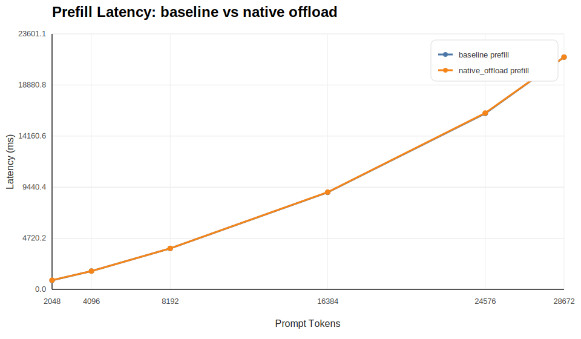
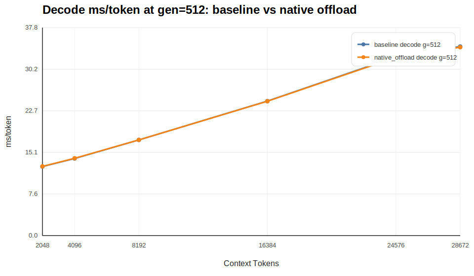

# PD Imitation Compare Report

## 1. 对照范围

- baseline results: `results/pd_imitation_qwen3_8b_instruct`
- compare results: `results/pd_imitation_qwen3_8b_instruct_native_offload`
- baseline label: `baseline`
- compare label: `native_offload`

## 2. 关键结论

1. 在最大共享 prefill bucket `prompt=28672` 上，`native_offload` 相比 `baseline` 的 prefill 平均延迟变化为 `-0.01%`。
2. 在最大共享 decode bucket `context=28672, gen=512` 上，`native_offload` 相比 `baseline` 的 decode `ms/token` 变化为 `-0.08%`。
3. 如果 `compare_label` 是 native CPU offloading，这两个量就是最值得先看的主指标：prefill 会不会被拉长，steady-state decode 会不会变差。

## 3. Prefill 对照

| prompt tokens | baseline mean ms | compare mean ms | delta % |
| --- | ---: | ---: | ---: |
| 2048 | 833.75 | 851.92 | +2.18% |
| 4096 | 1686.50 | 1686.67 | +0.01% |
| 8192 | 3779.75 | 3786.58 | +0.18% |
| 16384 | 8964.92 | 8982.83 | +0.20% |
| 24576 | 16253.58 | 16291.08 | +0.23% |
| 28672 | 21455.50 | 21453.75 | -0.01% |

## 4. Decode 对照（gen=512）

| context tokens | baseline ms/token | compare ms/token | delta % |
| --- | ---: | ---: | ---: |
| 2048 | 13.86 | 13.90 | +0.26% |
| 4096 | 16.35 | 16.39 | +0.27% |
| 8192 | 22.36 | 22.87 | +2.27% |
| 16384 | 36.34 | 35.77 | -1.58% |
| 24576 | 50.87 | 50.62 | -0.50% |
| 28672 | 50.88 | 50.85 | -0.08% |

## 5. 使用建议

- 如果 offloading 主要拉长的是大 context 下的 prefill，说明 CPU 侧 KV 搬运已经开始影响长 prompt 请求。
- 如果 offloading 主要拉长的是 `gen=512` 的 decode `ms/token`，说明它已经影响 steady-state decode，而不仅仅是固定开销。
- 如果只有小 generation bucket 变差而 `g=512` 变化不大，优先把它解释为固定开销或短序列效应，而不是 steady-state decode 退化。

