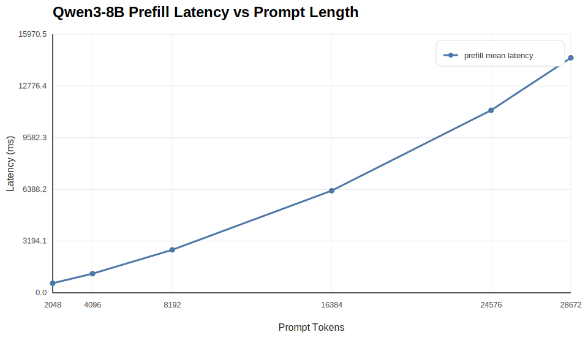
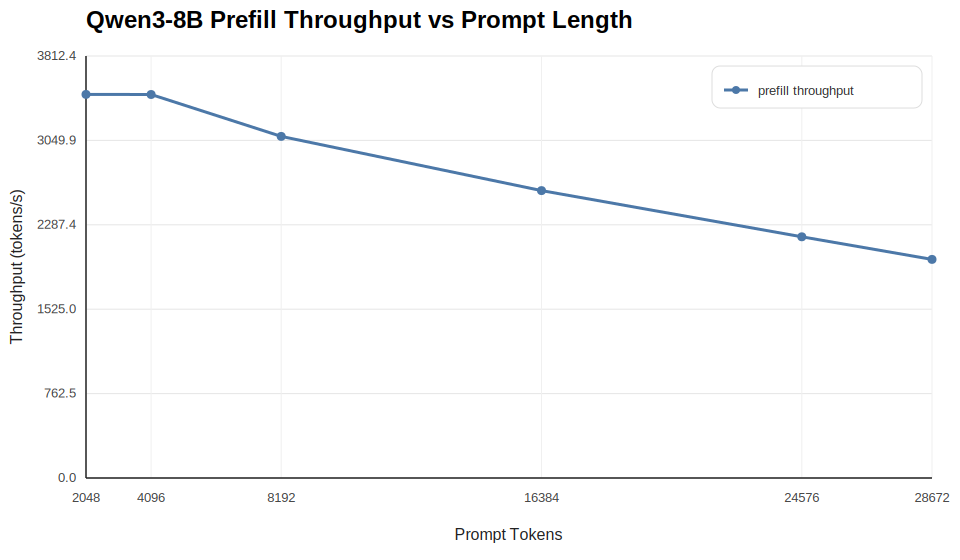
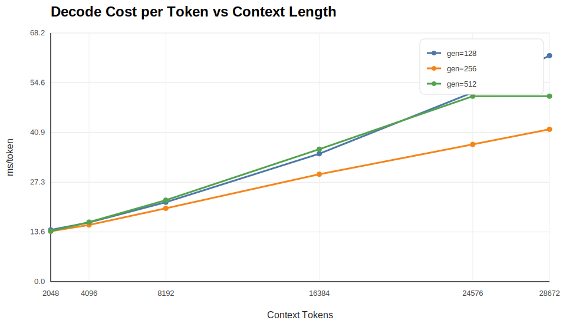
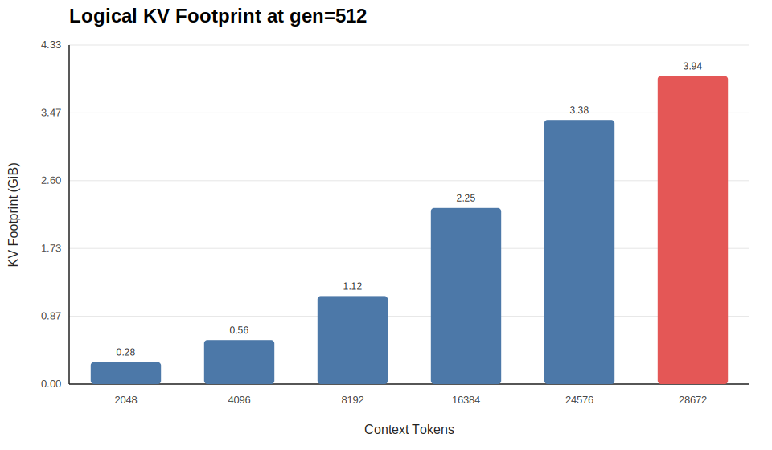

# Qwen3-8B-Instruct PD Imitation Results Report

## 1. 数据范围

本报告基于 `results/pd_imitation_qwen3_8b_instruct` 的一轮完整 phase-1 采样结果。

- 模型：`Qwen/Qwen3-8B`，服务名：`Qwen3-8B-Instruct`
- 采样对象：`prefill-only`、`decode-only`、逻辑 `pd_imitation_trace.csv`
- `prefill` 成功 bucket：`512 ~ 16384` tokens
- `decode` 成功 bucket：context `512 ~ 16384`，generation `32/64/128/256`
- 逻辑 trace 行数：`24`

补充说明：

- prefill bucket `32768` 有失败样本：`20 / 20`。
- 这类失败通常意味着 prompt 长度已经贴近 `max-model-len`，或者当前并发/配置下资源压力过高。
- 如果你后续还想贴近上限，建议把最大 bucket 再往下退一点，或者在保持 baseline/offloading 同配置的前提下降低并发。

## 2. 关键结论

1. `prefill` 延迟随 prompt 长度单调上升，从 `512` tokens 的 `51.45 ms` 增长到 `16384` tokens 的 `1794.30 ms`。
2. `prefill throughput` 在中等长度区间最高，峰值出现在 `2048` tokens，约为 `12022.31 tokens/s`；到 `16384` tokens 时回落到 `9131.14 tokens/s`。
3. `decode` 的粗粒度 `ms/token` 对 generation 长度很敏感：`g=32` 时固定开销占比很高，在 `16384` context 下膨胀到 `69.58 ms/token`；而 `g=256` 更接近稳态，区间约为 `11.09 ~ 13.07 ms/token`。
4. 逻辑 KV footprint 与 context 线性相关，本轮最大点是 `16384` tokens，对应 `2.25 GiB` 的 decode-side KV。

## 3. Prefill 结果

聚合结果：

| prompt tokens | samples | mean latency (ms) | std (ms) | throughput (tokens/s) |
| --- | ---: | ---: | ---: | ---: |
| 512 | 20 | 51.45 | 5.62 | 9951.41 |
| 1024 | 20 | 91.90 | 0.91 | 11142.55 |
| 2048 | 20 | 170.35 | 1.39 | 12022.31 |
| 4096 | 20 | 351.25 | 1.02 | 11661.21 |
| 8192 | 20 | 766.45 | 2.72 | 10688.24 |
| 16384 | 20 | 1794.30 | 11.72 | 9131.14 |

解读：

- `prefill latency` 基本随 token 数增加而近似线性上升，但在 `8K -> 16K` 区间已经出现更明显的超线性拉长。
- `prefill throughput` 不是单调增加的：它在 `2K ~ 4K` 左右最好，之后随着上下文变长开始回落。
- 这意味着如果你后面要做 PD imitation，prefill cost 不能只按“每 token 固定时间”处理，长上下文区间最好单独建桶。

## 4. Decode 结果

| context tokens | gen tokens | samples | mean total latency (ms) | ms/token | tokens/s |
| --- | ---: | ---: | ---: | ---: | ---: |
| 512 | 32 | 20 | 395.15 | 12.35 | 80.98 |
| 512 | 64 | 20 | 717.00 | 11.20 | 89.26 |
| 512 | 128 | 20 | 1424.55 | 11.13 | 89.85 |
| 512 | 256 | 20 | 2839.85 | 11.09 | 90.15 |
| 1024 | 32 | 20 | 441.00 | 13.78 | 72.56 |
| 1024 | 64 | 20 | 726.30 | 11.35 | 88.12 |
| 1024 | 128 | 20 | 1440.15 | 11.25 | 88.88 |
| 1024 | 256 | 20 | 2869.25 | 11.21 | 89.22 |
| 2048 | 32 | 20 | 528.40 | 16.51 | 60.56 |
| 2048 | 64 | 20 | 743.85 | 11.62 | 86.04 |
| 2048 | 128 | 20 | 1471.20 | 11.49 | 87.00 |
| 2048 | 256 | 20 | 2926.80 | 11.43 | 87.47 |
| 4096 | 32 | 20 | 724.60 | 22.64 | 44.16 |
| 4096 | 64 | 20 | 769.85 | 12.03 | 83.13 |
| 4096 | 128 | 20 | 1513.10 | 11.82 | 84.59 |
| 4096 | 256 | 20 | 2999.15 | 11.72 | 85.36 |
| 8192 | 32 | 20 | 1161.70 | 36.30 | 27.55 |
| 8192 | 64 | 20 | 813.35 | 12.71 | 78.69 |
| 8192 | 128 | 20 | 1580.90 | 12.35 | 80.97 |
| 8192 | 256 | 20 | 3115.15 | 12.17 | 82.18 |
| 16384 | 32 | 20 | 2226.60 | 69.58 | 14.37 |
| 16384 | 64 | 20 | 891.50 | 13.93 | 71.79 |
| 16384 | 128 | 20 | 1709.60 | 13.36 | 74.87 |
| 16384 | 256 | 20 | 3346.20 | 13.07 | 76.50 |

解读：

- 当前 `decode-only` 口径本质上是“长 context + 指定 generation length 的整段 elapsed time”，不是纯 kernel 级 decode 时间。
- 因此 `g=32` 的 `ms/token` 明显被固定开销污染，不能直接当成 steady-state decode 速度。
- 更大的 generation bucket 更接近稳定区间。本轮里，`g=256` 的 decode 吞吐区间约为 `76.50 ~ 90.15 tokens/s`。
- 对后续 case study，如果你需要一个更稳的 decode proxy，建议优先使用最大的 generation bucket；当前结果就是 `g=256`。

## 5. 逻辑 KV Footprint

本轮 trace 使用固定模型参数计算出：`KV_bytes_per_token = 147456`，也就是每 token `144 KiB`。

对应关系非常直接：

- `512` context: `0.07 GiB`
- `1024` context: `0.14 GiB`
- `2048` context: `0.28 GiB`
- `4096` context: `0.56 GiB`
- `8192` context: `1.12 GiB`
- `16384` context: `2.25 GiB`

这部分结论对 PD imitation 很关键：

- prefill 端产出的逻辑 KV 量与 prompt/context 长度线性相关。
- 即使不跑真实 PD，本轮也已经足够给后续 offloading / replay 提供一个量级可信的 KV 大小映射。

## 6. 对当前 trace 的使用建议

如果你现在要把这批结果送入后续 case study，我建议直接采用下面的口径：

1. `prefill_time_ms` 直接取当前 trace 里的桶均值。
2. `decode_time_ms` 如果是做粗粒度 phase-1 模拟，可以保留当前值。
3. 如果你更关心 steady-state decode，不要优先用 `g=32`，而是优先采信更大的 generation bucket；当前结果里建议使用 `g=256`。
4. 如果你要构造接近上限的长上下文 workload，建议把最大 bucket 保持在略低于上限的位置，并在相同并发下验证成功率。

## 7. 当前局限

- 这仍然是 `single-GPU` 的 phase-1 imitation，不是完整 PD serving。
- `decode-only` 当前口径包含固定开销，因此短 generation 桶会被高估。
- 当前 trace 还没有引入真实请求到达分布，也没有引入跨机传输带宽限制。

## 8. 输出位置

- trace: `results/pd_imitation_qwen3_8b_instruct/summary/pd_imitation_trace.csv`
- summary: `results/pd_imitation_qwen3_8b_instruct/summary/pd_imitation_summary.json`
- figures: `results/pd_imitation_qwen3_8b_instruct/fig`

