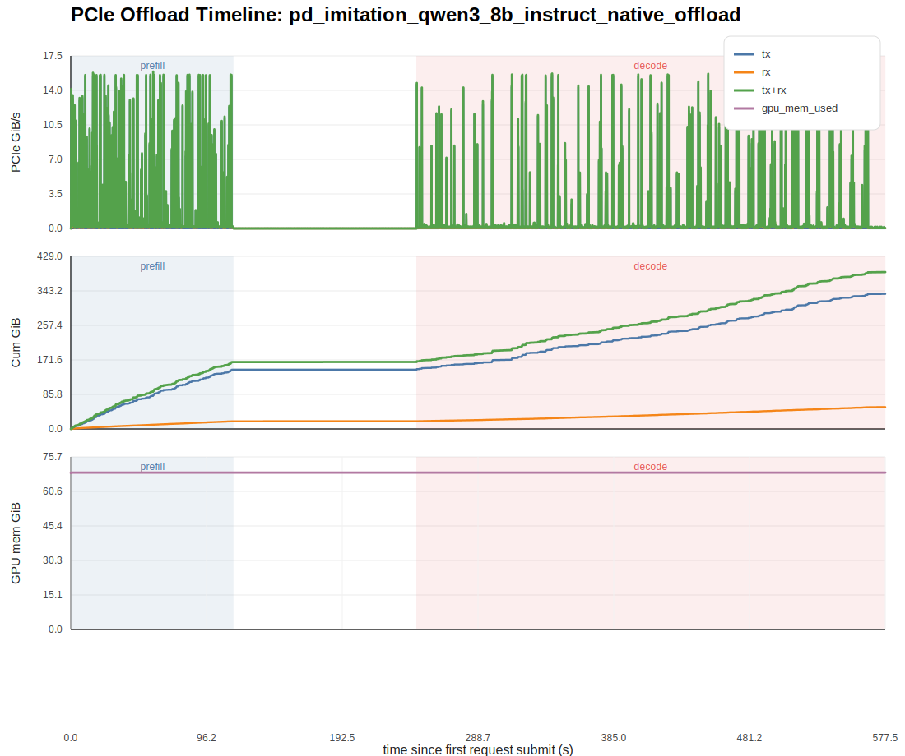

# PCIe Offload Observation Report: pd_imitation_qwen3_8b_instruct_native_offload

## 1. 观测范围

- full window start: `1774765141391`
- full window end: `1774765718935`
- prefill window: `1774765141391 -> 1774765256741`
- decode window: `1774765386354 -> 1774765718935`

这里记录的是 GPU 侧 NVML 提供的 PCIe TX/RX moving-average throughput。

- 最稳妥的主指标是 `pcie_total_GiB_s = tx + rx`。
- 在很多平台上，host->GPU 的 restore/offload-return 往往更容易体现在 GPU PCIe RX 上，但方向语义最好结合实测一起判断。

## 2. 时序图

## 3. 全窗口统计

- duration: `577.544 s`
- total TX volume: `335.592 GiB`
- total RX volume: `54.424 GiB`
- total bidirectional volume: `390.016 GiB`
- avg TX bandwidth: `0.581 GiB/s`
- avg RX bandwidth: `0.094 GiB/s`
- avg bidirectional bandwidth: `0.675 GiB/s`
- peak TX bandwidth: `15.599 GiB/s` at `451.955 s`
- peak RX bandwidth: `1.636 GiB/s` at `0.456 s`
- peak bidirectional bandwidth: `15.944 GiB/s` at `58.456 s`

## 4. 分阶段统计

| phase | duration (s) | tx total (GiB) | rx total (GiB) | total (GiB) | avg total GiB/s | peak total GiB/s |
| --- | ---: | ---: | ---: | ---: | ---: | ---: |
| prefill | 115.350 | 147.221 | 19.087 | 166.308 | 1.442 | 15.944 |
| decode | 332.581 | 188.273 | 35.253 | 223.525 | 0.672 | 15.862 |
| full | 577.544 | 335.592 | 54.424 | 390.016 | 0.675 | 15.944 |

## 5. 解读建议

- 如果你要抓“offloading 开始到最后 restore”的总体量，优先看 `full` 和 `decode` 的 `total_transfer_GiB`。
- 如果你要抓最容易体现 restore 的瞬时冲击，优先看 `decode` 窗口内的 `peak RX` 和 `peak total`。
- 如果 `total_transfer_GiB` 已经不小，但时间指标仍几乎不变，说明当前 offloading 流量可能存在，但还不足以成为端到端瓶颈。

